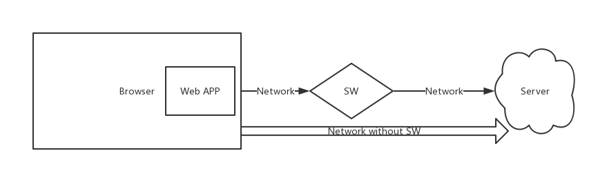
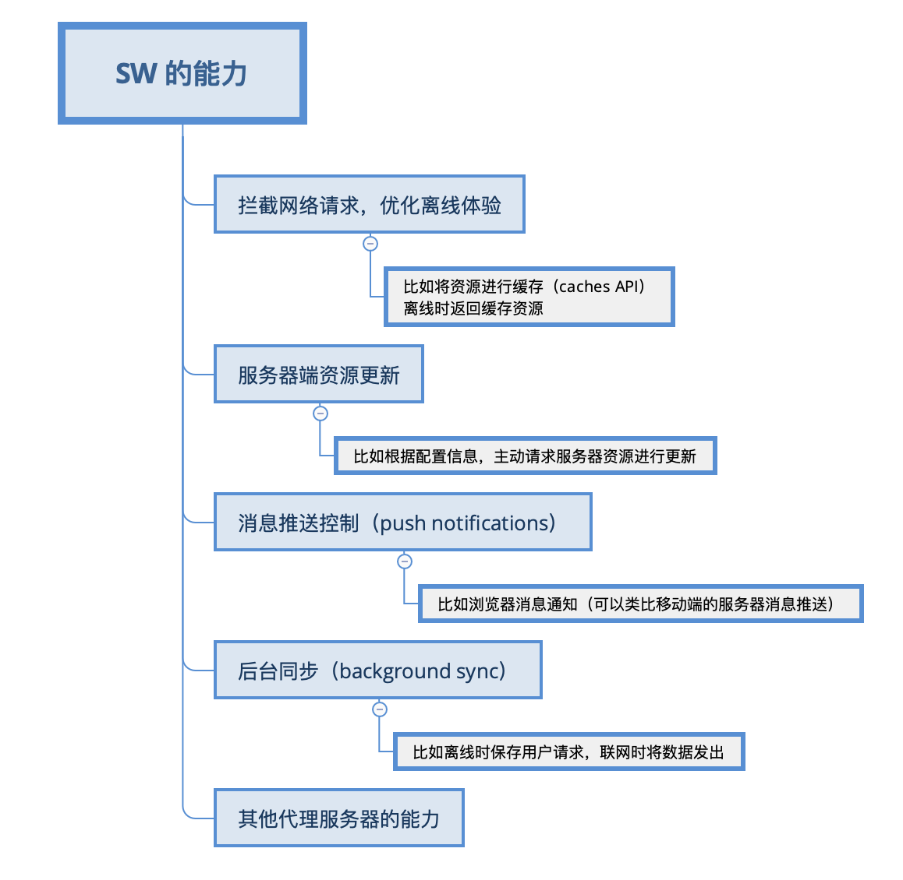
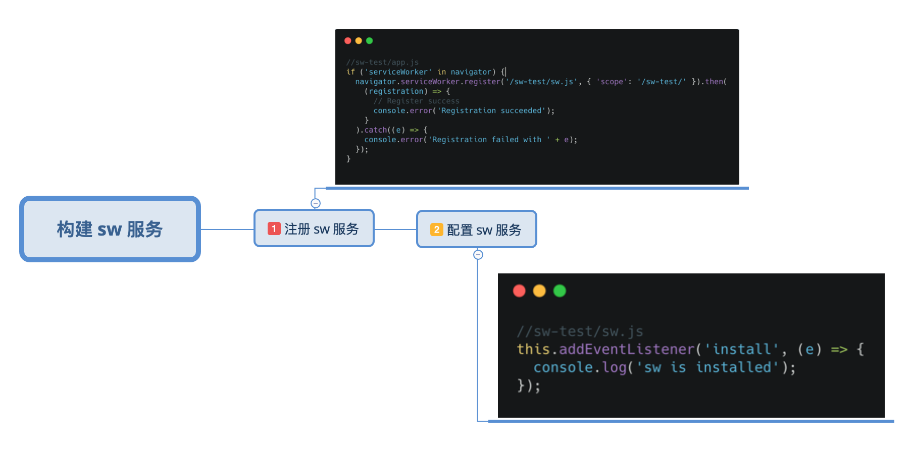
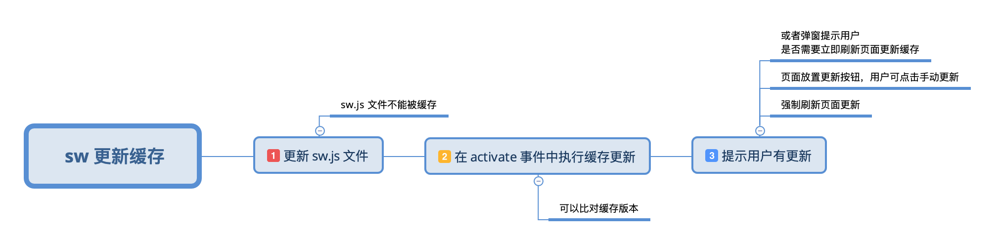
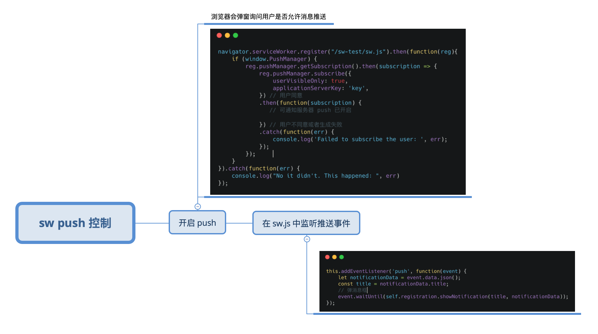
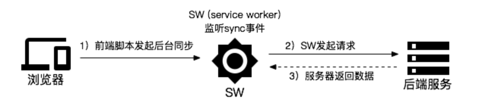
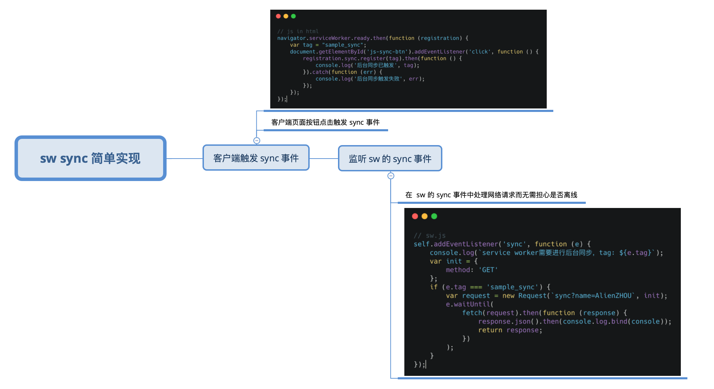

# Service Worker 知识体系

本文旨在通过各种图来总结说明 service worker 相关的知识点，可以理解为“service worker 的百科全图”😀。为了行文流畅，下文中统一用 sw 来指代 service worker，懒癌晚期见谅。

首先介绍一下环境

* 操作系统 MacOS Version(10.14.2)
* chrome Version 71.0.3578.98 

其次，本文适合对 sw 有基础认知的同学（清晰基本概念）。如果是零基础的同学，建议先拷贝[示例项目](https://github.com/yukap6/sw-demo)并配合[官方定义文档](https://developer.mozilla.org/zh-CN/docs/Web/API/Service_Worker_API/Using_Service_Workers)学习一遍基础知识，再回过头来学习本文会效果更佳。

## sw 是什么？能做什么？

[MDN 上 sw 的定义](https://developer.mozilla.org/en-US/docs/Web/API/Service_Worker_API)：sw 本质上是扮演了一个架设于 Web APP 和网络连接之间的代理服务器。一图胜千言



既然知道了 sw 是什么？那能做什么就看大家的想象力了，😜。是的，所有代理服务器的能力，sw 基本都可以有，除此之外，sw 还有几项隐秘的技能，且看下图



以上提到的各种能力，都有对应的 API，接下来通过实例演示来说明怎么使用 sw 的这些能力。

## 构建第一个 sw 应用程序

[示例项目](https://github.com/yukap6/sw-demo) 已上传至 github，克隆到本地按照 `README` 说明操作即可运行。

开启 sw 功能最主要的是做两件事情

1. 注册 sw 服务
2. 配置 sw 服务 

如下图(贴代码的目的是为了说明启用 sw 真的很 easy 😜)：


如上示例中，只是简单的说明了 sw 的注册和 `install` 事件监听，在深入解释如何进行 sw 编程之前，先介绍一下 sw 的各个生命周期。

## sw 的生命周期

一般情况下，sw 是在页面打开的时候，通过执行 js 脚本进行 注册->安装->激活。其生命周期如下图（请允许我盗图一张，画的太好，忍不住...）


关于生命周期的详细解释，[附文一篇，有兴趣请手动前往](https://bitsofco.de/the-service-worker-lifecycle/)。

小结一下：html 中执行 js 脚本进行 sw 注册，指定对应的 js 文件为 sw 的执行文件，随后浏览器会对当前注册的 sw 进行 解析->安装->激活 （或关闭）。在 sw 的指定 js 文件中，以 Demo 为例，`sw.js`，可以用 `self` 或 `this` 来引用当前 sw 的执行上下文，并且可以同时通过监听 `sw` 的各个事件来完成 sw 编程，实现功能。

这样看可能比较抽象，这里举几个栗子来一一说明如何结合 sw 的生命周期来实现各种 sw 的能力。

## sw 编程举栗

### 1、拦截网络请求、优化离线体验

sw 暴露了 `fetch` 事件，监听 `fetch` 事件即可实现对网络请求的监听，继而实现缓存就是“顺手牵羊”的事了，show me the code（还是以最开始的 [Demo](https://github.com/yukap6/sw-demo) 代码为例）

```
// 监听 sw 的 fetch 事件
this.addEventListener('fetch', (e) => {
  e.respondWith(
    // 先从缓存中去取目标资源
    caches.match(e.request).then((res) => {
      // 如果已经在缓存中，则直接返回匹配的资源
      if (res !== undefined) {
        return res;
      }
      // 不在缓存中，则发起正常的网络请求
      return fetch(e.request).then(response => {
        // 打开缓存
        return caches.open('v1').then(cache => {
          // 将获取的的资源放入缓存
          cache.put(e.request, response.clone());
          // 返回数据
          return response;
        });
      });
    }).catch((error) => {
      return caches.match('/sw-test/offline.png');
    })
  );
});
```

这里有个新概念 `caches`，[点此查看 MDN 详细定义](https://developer.mozilla.org/en-US/docs/Web/API/Cache)，不懂的同学可以简单理解为类似 `localstorage` 的API，暴露在 `window` 下，但是缓存能力更强大。

[示例项目](https://github.com/yukap6/sw-demo)里有一些不同，在 sw 的 `install` 事件里也做了缓存处理，这里是为了提前缓存，以提供更好的体验。（所以说，缓存并不一定要限制在哪里做，关键看你的需(脑)求(洞)）。

### 2. 服务端资源更新

这里其实可以换种说法：如果被 sw 缓存的资源在服务端更新了，如何更新 sw 缓存？看图不说话🤐



2个点
  
  * 如何通知用户？可以通过 postMessage
  * 缓存更新后不是实时应用的么？答案是：不是的，必须等到旧的 sw 实例不再被使用的时候，才能激活新的 sw 实例。（这也是新的 sw 替换旧的 sw 的机制）

### 3. 消息推送（push）

push 简单理解就是 web 消息推送：服务器有信息更新，可以主动推送到客户端，当客户端打开时，则可以接收到对应推送消息，掘金有一篇文章解释的很到位，[点此前往](https://juejin.im/post/59d9b38ef265da064a0f72cc)。

首先明确几个要素

* 客户端消息推送的开关在 sw 中进行控制
* 消息推送到客户端的时候，需要监听 sw 的 `push` 事件来进行处理

看图不说话



### 4. 后台同步（sync）

后台同步是一种新的Web API，可让您将操作推迟到用户具有稳定连接后再执行。 这对于确保实际发送用户想要发送的内容非常有用。（[点击前往查看官方定义](https://developers.google.com/web/updates/2015/12/background-sync)）

举个🌰就清晰明了了：假设有一个调查问卷页面，用户填写了所有内容后，准备提交答案时，离线了，此时用户点击了保存按钮，不出意外就会看到“菊花”(loading...)一直在那转，直到连接超时。传统情况下，系统能做的就是提醒用户有了网络连接之后需要回来该页面进行再次提交，别无他法。依赖 sw 的 sync 之后就很简单了，用户点击提交即可，无需确认网络是否正常，当用户提交时，处于离线状态，sync 可以将用户的操作延迟执行，等到网络正常之后再将该请求发出去，完美体验。



举个简单实现的🌰



到这里，sw 基本能力已经介绍的差不多了，下面进入答疑环节，给出一些常见问题的答案。

## Q&A

Q1: sw 第一次安装成功后会立即生效吗？

> 答：不会实时生效。需等到页面再次打开（或刷新）后才能被激活并进入应用状态。

Q2: sw 会被多次安装吗？也就是说会同时有多个 sw 实例运行吗？

> 答：不会。新的 sw 实例会在旧的实例完全废弃之后才启用。如果 `sw.js` 文件未更新，则不会生成新的实例。

Q3: chrome 如何默认开启 sw 支持?

> 答：访问 chrome://flags 并开启 experimental-web-platform-features; 重启浏览器 (注意：有些特性在Chrome中没有默认开放支持)。（其他浏览器可自行 google）

Q4: chrome 缓存文件时报错类似 `sw.js:31 Uncaught (in promise) TypeError: Request scheme 'chrome-extension' is unsupported` 该如何解决？

> 答：这是因为 chrome 的插件资源无法被缓存，缓存时进行特殊判断即可，如下给出示例代码

```
// chrome extension file can't to be cached
if (/^chrome-extension:/.test(e.request.url)) {
  return fetch(e.request).then((response) => {
    return response;
  });
}
```

Q5: sw 缓存静态资源后，服务器关闭了，还能访问吗？

> 答：亲测可用。

Q6: sw 注册指定的 js 文件必须用 `sw.js` 这个文件名吗？

> 答：不是的。文件名可以任意定义，只需要注册的时候指定对应名称即可。
