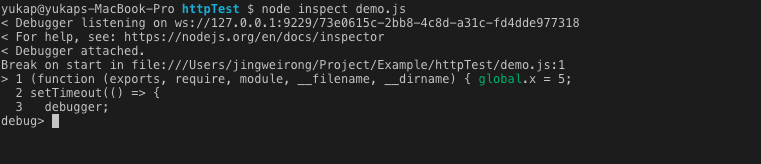
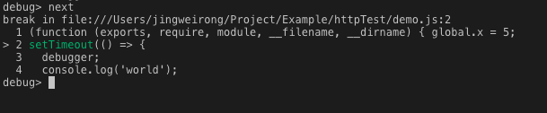
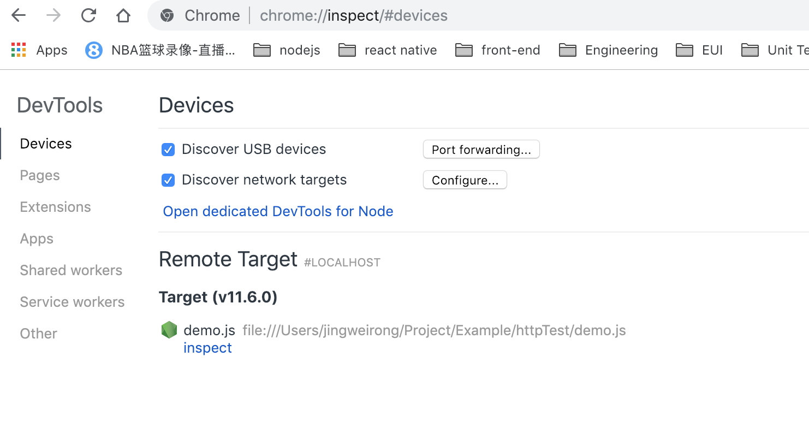
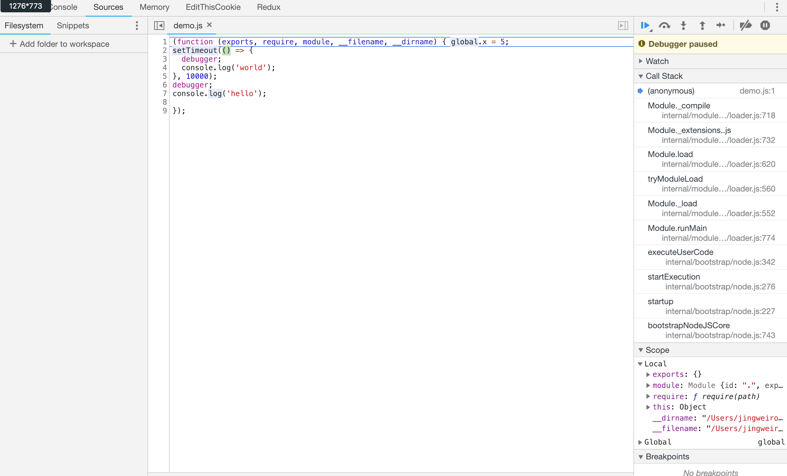
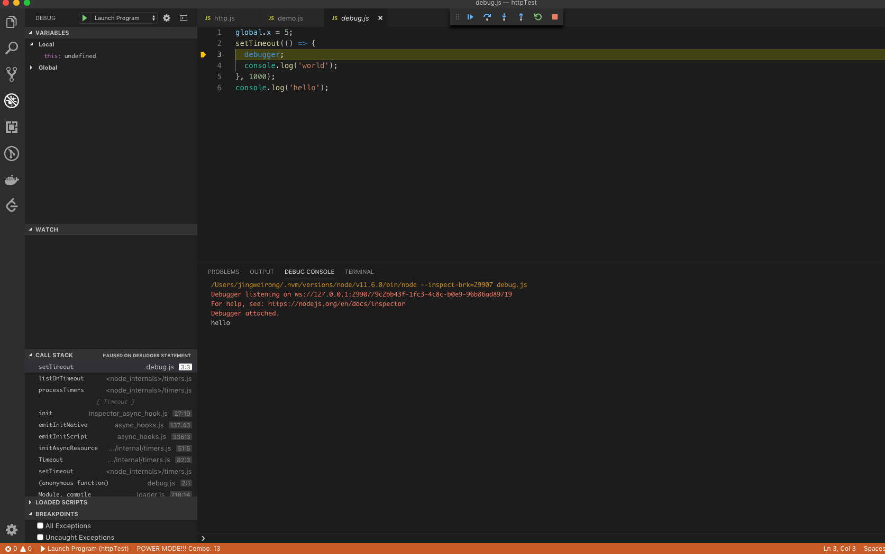
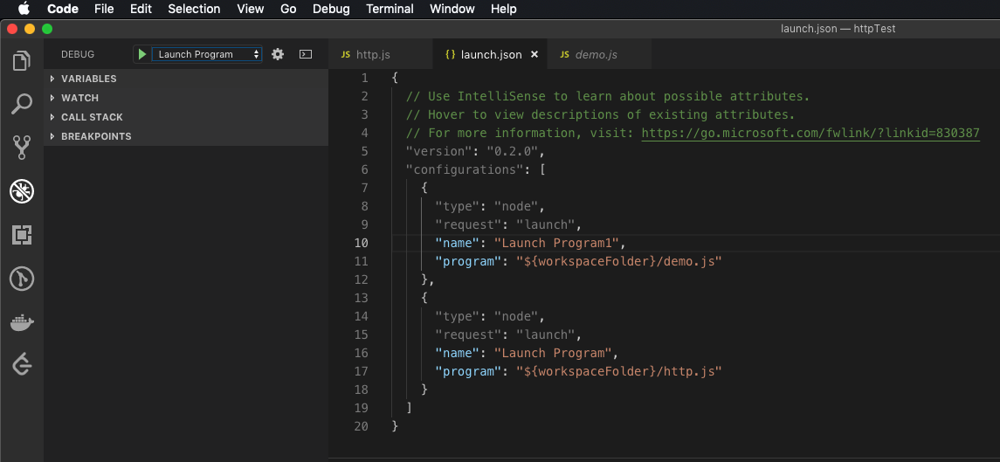
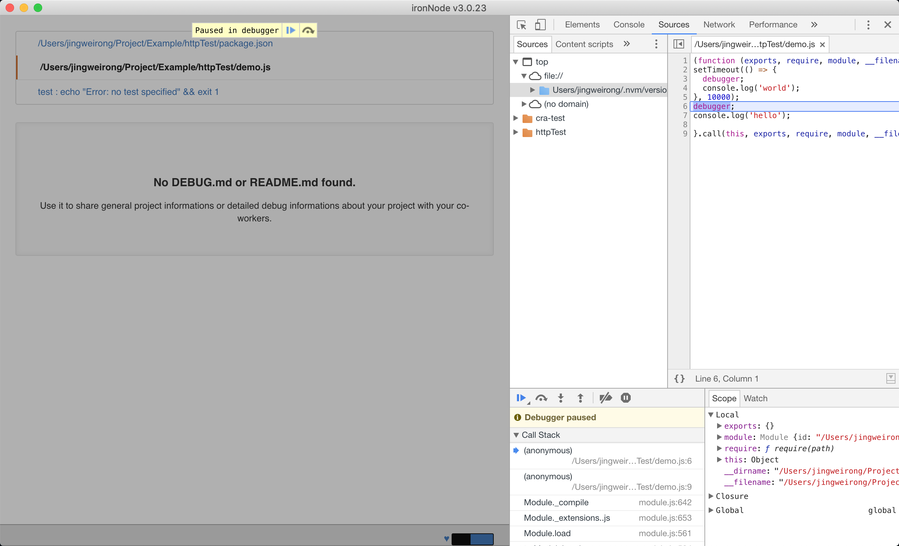

# Node.js 调试

## 准备工作

环境

```
IDE: vsCode Version 1.30.2
node: v11.6.0
Operation System: macOS 10.14.2
```

下文中使用的调试代码如下

```
// demo.js
global.x = 5;
setTimeout(() => {
  debugger;
  console.log('world');
}, 10000);
debugger;
console.log('hello');
```

## 方案1：使用 node 自带命令行工具

执行命令 `node inspect demo.js`，效果如下图所示



* 控制台第一行输出表示 node 进程监听 WebSockets 对应地址为 `ws://127.0.0.1:9229/73e0615c-2bb8-4c8d-a31c-fd4dde977318`。通过该地址即可连接 node 进程进行调试。
* `Break on start in file:///Users/jingweirong/Project/Example/httpTest/demo.js:1` 表示默认从第一行开始进入断点调试。

命令行下有很多命令来控制调试，以下一步为例，其命令为 `next` 即可执行到下一步，如下图所示。这种调试模式仅限于调试同步代码，对于定时器或者 `HTTP` 服务等异步代码则无能为力，更多相关命令请参阅[官方文档](https://nodejs.org/api/debugger.html)。



这种方式由于其局限性，不再深入介绍，执行命令 `.exit` 退出当前调试状态。

## 方案2：使用谷歌浏览器开发者工具调试

执行命令 `node inspect demo.js`，此时代码默认进入第一行并自动断点，然后打开 Chrome 浏览器，访问 chrome://inspect，如下所示



在 Target 一栏可以找到 demo.js 并点击对应的 `inspect` 链接即可打开 chrome 开发者工具对 demo.js 进行调试，如下图所示



工具面板中，source 面板是最常访问的面板，所有的资源文件都可以在这里找到，可以像调试普通 `js` 代码一样打断点或者执行下一步。console 面板和 node 的控制台输出是一致的，所有的 `console.log` 代码输出都会在 console 面板显示。右下角可以看到变量跟踪，分为 Local 和 Global 两部分，Local 显示所有局部变量，Global 则对应全局变量。右上角则可以控制代码的执行，下一步，继续执行或者进入函数等，和普通网页代码调试并无二致。

这也是官方推荐的调试方式。

如上启动调试代码的命令默认为 `node inspect demo.js`，其实还有另外一种方式就是使用 `node-inspect` 包。首先安装该包 `npm install node-inspect -g`，接着执行命令 `node-insepect demo.js`，效果同上。

## 方案3：使用 vscode 进行调试

首先在 Debug->Open Configurations（调试->设置） 将 node 作为首选设置。设置好之后，打开 `demo.js`，点击 Debugg->Start Debugging(调试->开始调试)进入调试状态，效果如下图



可以看到代码停在了 `debugger` 那一行。左侧面板有变量跟踪（Local & Global）, CALL STACK（调用栈），中间最顶部是调试常用的下一步、进入代码等常用调试按钮，底部 DEBUG CONSOLE 显示的是当前调试控制台输出，功能极其强大，使用 vscode 作为编辑器的同学使用该方式进行代码调试最方便不过了。

这里要注意的是，需要调试文件的代码默认是被拷贝到一个叫 `debug.js` 的文件里执行的，如上图所示。所以当需要调试另外一个文件的代码时，点击 Debug->Start Debugging(调试->开始调试)默认会打开 `debug.js` 进行调试，依旧是上一次调试文件的代码，而不是当前打开文件的代码，此时把需要调试代码拷贝到 `debug.js` 即可。或者打开 vscode 的 Debug->Open Configurations(调试->配置)，增加多一条对于本项目主文件的调试配置如下截图所示



在上图中，配置了两个文件的调试 `demo.js` 和 `http.js`，需要调试对应文件时，选择左上角的下拉列表选择对应文件配置即可进行调试。因为大多数项目的启动文件都为 `index.js`，所以建议添加如下一段默认配置

```
{
  "type": "node",
  "request": "launch",
  "name": "index.js",
  "program": "${workspaceFolder}/index.js"
}
```

其他 IDE 调试都是大同小异的，官方已有提及，这里不再赘述。

## 方案4：使用 iron-node 调试

安装 iron-node `npm install iron-node -g`。

开启调试 `iron-node demo.js`，效果如下图



可以看到 iron-node 是依赖 electron 自带了谷歌浏览器的开发者工具，启动调试后会自动打开自带的调试工具。其原理与 *方案2：使用谷歌开发者工具调试* 是一致的，区别在于 iron-node 把需要手动打开 Chrome 进行调试这一步省略掉了，改为了自动打开并定位到对应调试文件。

列出的这几种调试方案中，推荐 *方案3 使用 vscode 进行调试* 或者 *方案4 使用 iron-node 调试*，这两种方案基本都是一步开启调试，不需要太多额外工作。

## 答疑

### 为什么不是使用 `node --inspect <filename>` 开启调试呢？

简单解释就是：使用这种方式只是打开了调试服务，但代码执行并不会在 `debugger` 所处行进行自动暂停，而是需要通过 WebSockets 连接 node 进程开启的调试服务之后才能进入调试状态，那么就会存在，开发人员还没打开 chrome://inspect 连接到对应服务时，代码已经执行完毕了，此时就错过了调试代码的时机，关于这个解释阮一峰老师有一篇文章解释的很清晰，[有兴趣的童鞋可以点击前往](http://www.ruanyifeng.com/blog/2018/03/node-debugger.html)，因为这种方式非常不常用，所以不再详细展开。

（完）

参考链接

* https://nodejs.org/en/docs/guides/debugging-getting-started/
* http://www.ruanyifeng.com/blog/2018/03/node-debugger.html
* https://nodejs.org/api/debugger.html
